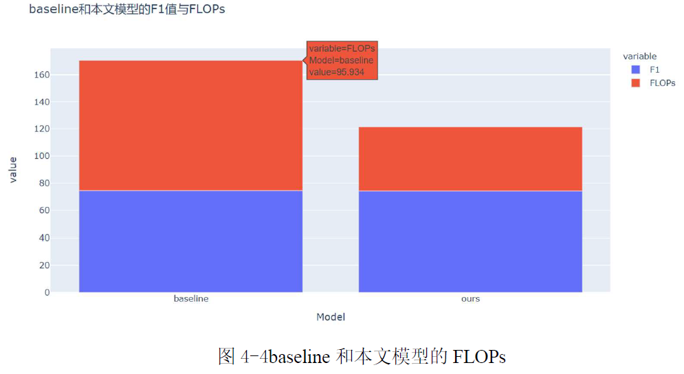
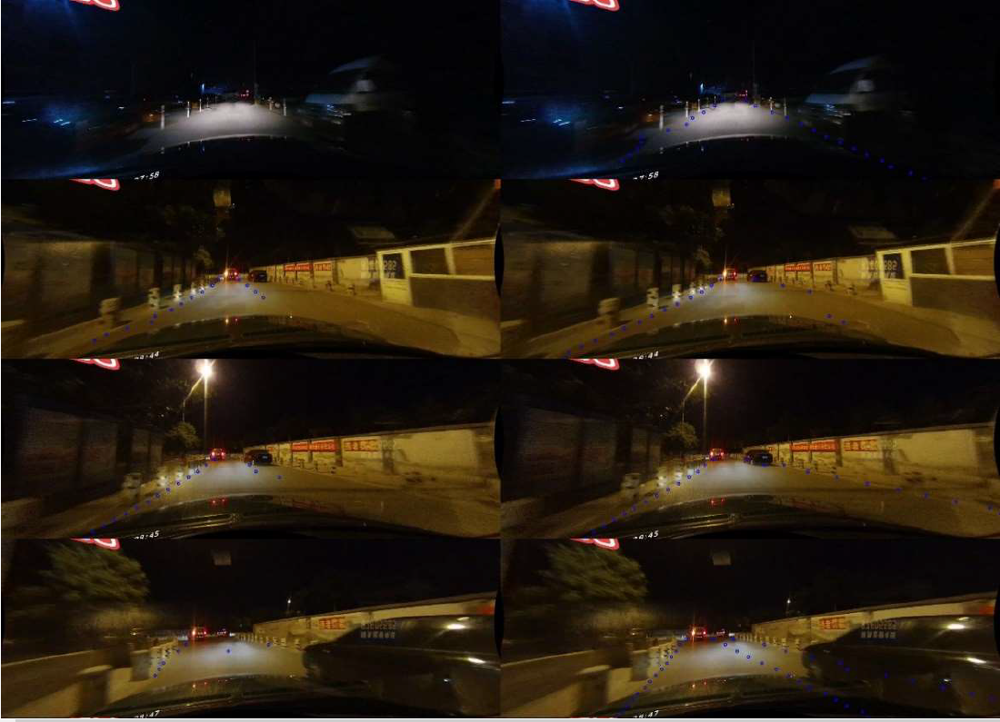
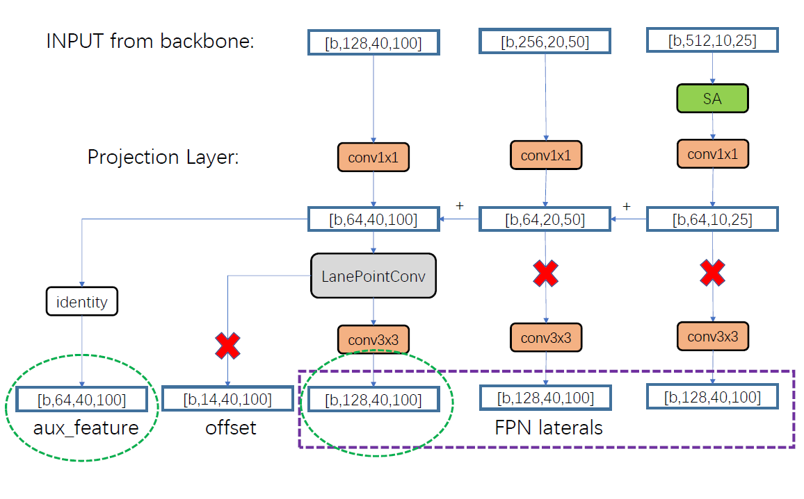
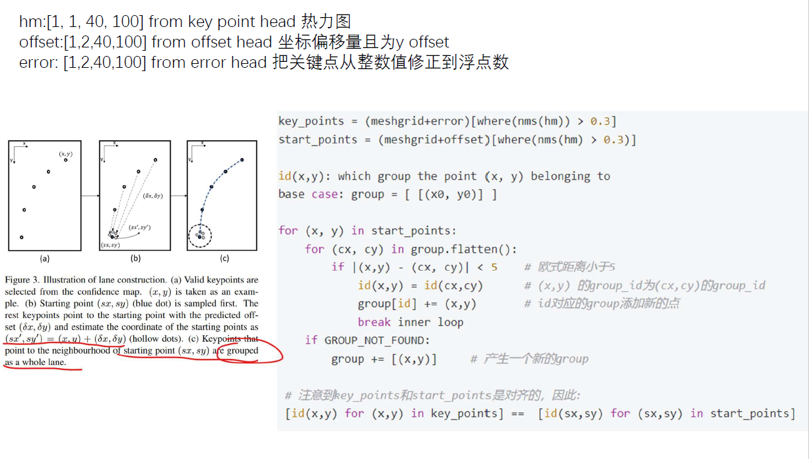

# 车道线检测项目
## 毕业设计:基于图像分割技术进行车道线检测
- 论文请参考graduation_project_lane_detection.pdf
- 对应project文件夹: lane_detection_segmentation
本文的贡献: 

1. **在baseline计算量减少一半的情况下保持了F1精度，提高了车道线检测的实时性**

2. **在backbone加入了全局信息，使得其在黑夜检测的效果更加明显**  
3. **研究了不同风格的注意力机制对基于anchor推理的车道线检测模型和基于分割进行推理的车道线模型产生的不同影响**

## 近期工作: 关键点聚类的推理方法进行车道线检测
> 主要参考论文:A Keypoint-based Global Association Network for Lane Detection  

- 制作了ppt方便理解: GANet.pdf
- 对应的project文件夹: GANet,在文件GANet/mmdetv2中进行了代码修改  
预览:
  
